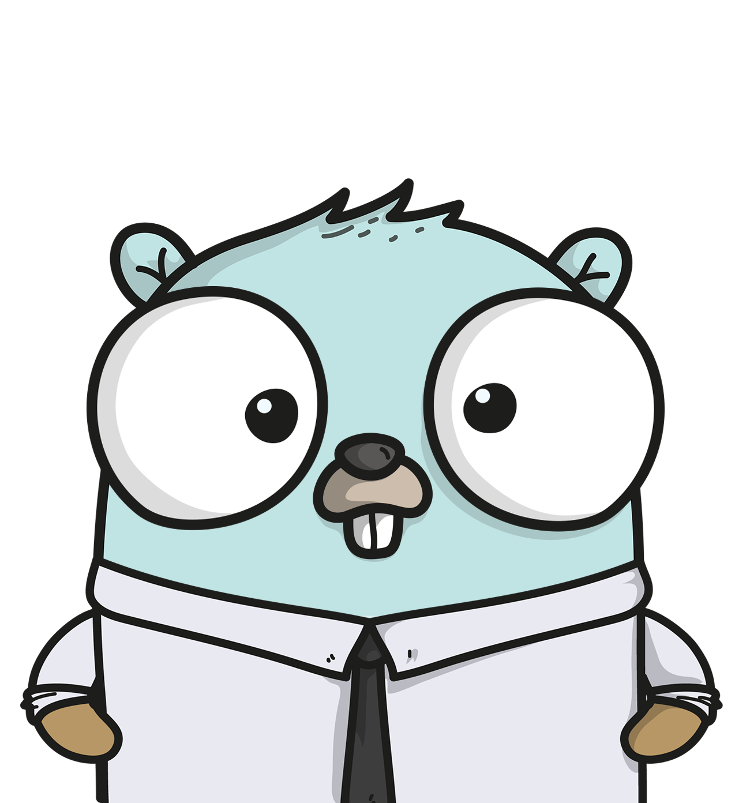

<br />
<div align="center">
  <a href="https://github.com/theapexlab/pocok">
    
  </a>

  <h3 align="center">POCOK</h3>

  <p align="center">
    A fast way to pay your invoices right in your email.
    <br />
    <br />
  </p>
</div>

### Built with

- [Serverless Stack](https://serverless-stack.com/)
- [Go](https://golang.org/)
- [AWS](https://aws.amazon.com/)

## Getting started

### Prerequisites

Register an [AWS account](https://aws.amazon.com/resources/create-account/) and configure [AWS CLI](https://github.com/aws/aws-cli) with your credentials. (for local lambda environment)

Install the SST dependencies:

```bash
$ yarn
```

## Commands

### `yarn start`

Starts the local Lambda development environment.

### `yarn build`

Build your app and synthesize your stacks.

Generates a `.build/` directory with the compiled files and a `.build/cdk.out/` directory with the synthesized CloudFormation stacks.

### `yarn deploy [stack]`

Deploy all your stacks to AWS. Or optionally deploy a specific stack.

### `yarn remove [stack]`

Remove all your stacks and all of their resources from AWS. Or optionally remove a specific stack.

### `yarn test`

Runs your tests using Jest. Takes all the [Jest CLI options](https://jestjs.io/docs/en/cli).

## Acknowledgments

Logo - [Gopherize.me](https://gopherize.me/)
